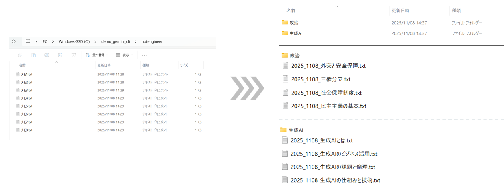

# 非エンジニア向けGemini CLIデモ
フォルダ内のテキストファイルの内容をすべて確認して、名前変更及び、フォルダ整理してくれるデモ用ファイルです。

**イメージ**




## 使用方法
1. `demofiles`フォルダの中で`Gemini CLI`を起動。
2. 下記プロンプトを入力し、実行。

## プロンプト

以下は、Gemini CLIにフォルダ作業をお願いする際のプロンプトです。
```text
.txtファイルの中身を確認し、ファイル名を端的なスペースなしの日本語で命名しなおしてフォルダ分けをしてください。フォルダは2つで分類してください。ファイル名例2025_1110_生成AI_LLMとは.txt。
```
